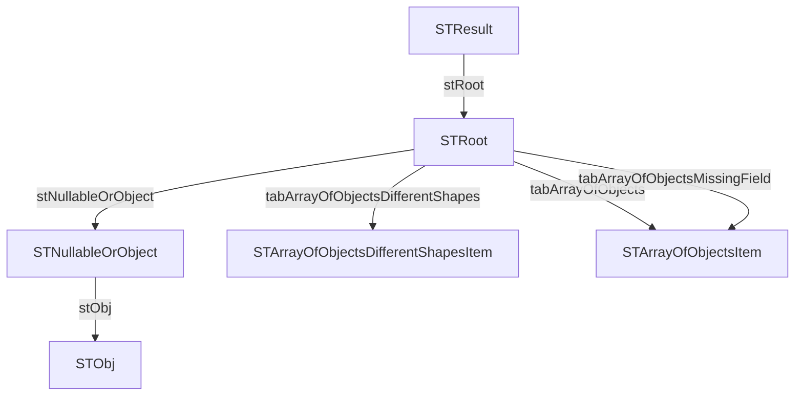

# JSON → WinDev structures

## Summary

- Structures: **6**
- Fields: **20**
- Arrays: **10**
- Variant fields: **4**
- Max depth: **4**

## Rules snapshot

- Prefixes enabled: **True**
- Serialize enabled: **True**

### Prefixes

| Kind | Prefix |
|---|---|
| string | `s` |
| int | `n` |
| real | `r` |
| boolean | `b` |
| array | `tab` |
| structure | `st` |
| variant | `v` |

### Type mapping

| JSON kind | WinDev type |
|---|---|
| string | `une chaîne` |
| int | `un entier` |
| real | `un réel` |
| boolean | `un booléen` |
| null / heterogeneous | `un Variant` |

### Array rules

- Empty array: `un tableau de Variant`
- Array of strings: `un tableau de chaînes`
- Generic: `un tableau de {item}`

## Notes

- Fields are generated using WinDev prefixes (if enabled) but keep JSON compatibility via `<serialize="jsonKey">`.
- `null` values and heterogeneous types are mapped to `Variant`.
- Empty arrays are mapped according to `array.empty` in the rules.

## Structure dependency table

| Parent structure | Field | Child structure |
|---|---|---|
| `STNullableOrObject` | `stObj` | `STObj` |
| `STResult` | `stRoot` | `STRoot` |
| `STRoot` | `stNullableOrObject` | `STNullableOrObject` |
| `STRoot` | `tabArrayOfObjects` | `STArrayOfObjectsItem` |
| `STRoot` | `tabArrayOfObjectsDifferentShapes` | `STArrayOfObjectsDifferentShapesItem` |
| `STRoot` | `tabArrayOfObjectsMissingField` | `STArrayOfObjectsItem` |

## Mermaid dependency graph



## Structure dependencies

This section shows which WinDev structures reference other structures.

- `STResult`
  - `STRoot`
    - `STArrayOfObjectsDifferentShapesItem`
    - `STArrayOfObjectsItem`
    - `STNullableOrObject`
      - `STObj`


## Table of contents

- [STArrayOfObjectsItem](#starrayofobjectsitem)
- [STArrayOfObjectsDifferentShapesItem](#starrayofobjectsdifferentshapesitem)
- [STObj](#stobj)
- [STNullableOrObject](#stnullableorobject)
- [STRoot](#stroot)
- [STResult](#stresult)

## Structures

### STArrayOfObjectsItem

| JSON key | WinDev field | WinDev type | Serialize |
|---|---|---|---|
| `id` | `nId` | `un entier` | `<serialize="id">` |
| `name` | `sName` | `une chaîne` | `<serialize="name">` |

### STArrayOfObjectsDifferentShapesItem

| JSON key | WinDev field | WinDev type | Serialize |
|---|---|---|---|
| `id` | `nId` | `un entier` | `<serialize="id">` |
| `code` | `sCode` | `une chaîne` | `<serialize="code">` |

### STObj

| JSON key | WinDev field | WinDev type | Serialize |
|---|---|---|---|
| `k` | `sK` | `une chaîne` | `<serialize="k">` |

### STNullableOrObject

| JSON key | WinDev field | WinDev type | Serialize |
|---|---|---|---|
| `maybe` | `vMaybe` | `un Variant` | `<serialize="maybe">` |
| `obj` | `stObj` | `un STObj` | `<serialize="obj">` |

### STRoot

| JSON key | WinDev field | WinDev type | Serialize |
|---|---|---|---|
| `ints` | `tabInts` | `un tableau de entier` | `<serialize="ints">` |
| `reals` | `tabReals` | `un tableau de réel` | `<serialize="reals">` |
| `int_and_real` | `tabIntAndReal` | `un tableau de réel` | `<serialize="int_and_real">` |
| `strings` | `tabStrings` | `un tableau de chaînes` | `<serialize="strings">` |
| `mixed_scalars` | `tabMixedScalars` | `un tableau de Variant` | `<serialize="mixed_scalars">` |
| `mixed_with_null` | `tabMixedWithNull` | `un tableau de chaînes` | `<serialize="mixed_with_null">` |
| `empty_array` | `tabEmptyArray` | `un tableau de Variant` | `<serialize="empty_array">` |
| `array_of_objects` | `tabArrayOfObjects` | `un tableau de STArrayOfObjectsItem` | `<serialize="array_of_objects">` |
| `array_of_objects_missing_field` | `tabArrayOfObjectsMissingField` | `un tableau de STArrayOfObjectsItem` | `<serialize="array_of_objects_missing_field">` |
| `array_of_objects_different_shapes` | `tabArrayOfObjectsDifferentShapes` | `un tableau de STArrayOfObjectsDifferentShapesItem` | `<serialize="array_of_objects_different_shapes">` |
| `nullable_field` | `vNullableField` | `un Variant` | `<serialize="nullable_field">` |
| `nullable_or_object` | `stNullableOrObject` | `un STNullableOrObject` | `<serialize="nullable_or_object">` |

### STResult

| JSON key | WinDev field | WinDev type | Serialize |
|---|---|---|---|
| `root` | `stRoot` | `un STRoot` | `<serialize="root">` |

## Generated WinDev code

```wlanguage
STArrayOfObjectsItem est une structure
    nId est un entier <serialize="id">
    sName est une chaîne <serialize="name">
FIN

STArrayOfObjectsDifferentShapesItem est une structure
    nId est un entier <serialize="id">
    sCode est une chaîne <serialize="code">
FIN

STObj est une structure
    sK est une chaîne <serialize="k">
FIN

STNullableOrObject est une structure
    vMaybe est un Variant <serialize="maybe">
    stObj est un STObj <serialize="obj">
FIN

STRoot est une structure
    tabInts est un tableau de entier <serialize="ints">
    tabReals est un tableau de réel <serialize="reals">
    tabIntAndReal est un tableau de réel <serialize="int_and_real">
    tabStrings est un tableau de chaînes <serialize="strings">
    tabMixedScalars est un tableau de Variant <serialize="mixed_scalars">
    tabMixedWithNull est un tableau de chaînes <serialize="mixed_with_null">
    tabEmptyArray est un tableau de Variant <serialize="empty_array">
    tabArrayOfObjects est un tableau de STArrayOfObjectsItem <serialize="array_of_objects">
    tabArrayOfObjectsMissingField est un tableau de STArrayOfObjectsItem <serialize="array_of_objects_missing_field">
    tabArrayOfObjectsDifferentShapes est un tableau de STArrayOfObjectsDifferentShapesItem <serialize="array_of_objects_different_shapes">
    vNullableField est un Variant <serialize="nullable_field">
    stNullableOrObject est un STNullableOrObject <serialize="nullable_or_object">
FIN

STResult est une structure
    stRoot est un STRoot <serialize="root">
FIN

Resultat est un STResult
```
