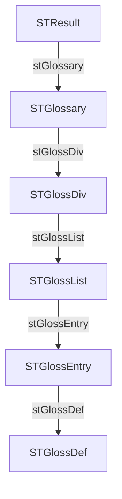

# JSON → WinDev structures

## Summary

- Structures: **6**
- Fields: **15**
- Arrays: **1**
- Variant fields: **0**
- Max depth: **7**

## Rules snapshot

- Prefixes enabled: **True**
- Serialize enabled: **True**

### Prefixes

| Kind | Prefix |
|---|---|
| string | `s` |
| int | `n` |
| real | `r` |
| boolean | `b` |
| array | `tab` |
| structure | `st` |
| variant | `v` |

### Type mapping

| JSON kind | WinDev type |
|---|---|
| string | `une chaîne` |
| int | `un entier` |
| real | `un réel` |
| boolean | `un booléen` |
| null / heterogeneous | `un Variant` |

### Array rules

- Empty array: `un tableau de Variant`
- Array of strings: `un tableau de chaînes`
- Generic: `un tableau de {item}`

## Notes

- Fields are generated using WinDev prefixes (if enabled) but keep JSON compatibility via `<serialize="jsonKey">`.
- `null` values and heterogeneous types are mapped to `Variant`.
- Empty arrays are mapped according to `array.empty` in the rules.

## Structure dependency table

| Parent structure | Field | Child structure |
|---|---|---|
| `STGlossDiv` | `stGlossList` | `STGlossList` |
| `STGlossEntry` | `stGlossDef` | `STGlossDef` |
| `STGlossList` | `stGlossEntry` | `STGlossEntry` |
| `STGlossary` | `stGlossDiv` | `STGlossDiv` |
| `STResult` | `stGlossary` | `STGlossary` |

## Mermaid dependency graph



## Structure dependencies

This section shows which WinDev structures reference other structures.

- `STResult`
  - `STGlossary`
    - `STGlossDiv`
      - `STGlossList`
        - `STGlossEntry`
          - `STGlossDef`


## Table of contents

- [STGlossDef](#stglossdef)
- [STGlossEntry](#stglossentry)
- [STGlossList](#stglosslist)
- [STGlossDiv](#stglossdiv)
- [STGlossary](#stglossary)
- [STResult](#stresult)

## Structures

### STGlossDef

| JSON key | WinDev field | WinDev type | Serialize |
|---|---|---|---|
| `para` | `sPara` | `une chaîne` | `<serialize="para">` |
| `GlossSeeAlso` | `tabGlossSeeAlso` | `un tableau de chaînes` | `<serialize="GlossSeeAlso">` |

### STGlossEntry

| JSON key | WinDev field | WinDev type | Serialize |
|---|---|---|---|
| `ID` | `sID` | `une chaîne` | `<serialize="ID">` |
| `SortAs` | `sSortAs` | `une chaîne` | `<serialize="SortAs">` |
| `GlossTerm` | `sGlossTerm` | `une chaîne` | `<serialize="GlossTerm">` |
| `Acronym` | `sAcronym` | `une chaîne` | `<serialize="Acronym">` |
| `Abbrev` | `sAbbrev` | `une chaîne` | `<serialize="Abbrev">` |
| `GlossDef` | `stGlossDef` | `un STGlossDef` | `<serialize="GlossDef">` |
| `GlossSee` | `sGlossSee` | `une chaîne` | `<serialize="GlossSee">` |

### STGlossList

| JSON key | WinDev field | WinDev type | Serialize |
|---|---|---|---|
| `GlossEntry` | `stGlossEntry` | `un STGlossEntry` | `<serialize="GlossEntry">` |

### STGlossDiv

| JSON key | WinDev field | WinDev type | Serialize |
|---|---|---|---|
| `title` | `sTitle` | `une chaîne` | `<serialize="title">` |
| `GlossList` | `stGlossList` | `un STGlossList` | `<serialize="GlossList">` |

### STGlossary

| JSON key | WinDev field | WinDev type | Serialize |
|---|---|---|---|
| `title` | `sTitle` | `une chaîne` | `<serialize="title">` |
| `GlossDiv` | `stGlossDiv` | `un STGlossDiv` | `<serialize="GlossDiv">` |

### STResult

| JSON key | WinDev field | WinDev type | Serialize |
|---|---|---|---|
| `glossary` | `stGlossary` | `un STGlossary` | `<serialize="glossary">` |

## Generated WinDev code

```wlanguage
STGlossDef est une structure
    sPara est une chaîne <serialize="para">
    tabGlossSeeAlso est un tableau de chaînes <serialize="GlossSeeAlso">
FIN

STGlossEntry est une structure
    sID est une chaîne <serialize="ID">
    sSortAs est une chaîne <serialize="SortAs">
    sGlossTerm est une chaîne <serialize="GlossTerm">
    sAcronym est une chaîne <serialize="Acronym">
    sAbbrev est une chaîne <serialize="Abbrev">
    stGlossDef est un STGlossDef <serialize="GlossDef">
    sGlossSee est une chaîne <serialize="GlossSee">
FIN

STGlossList est une structure
    stGlossEntry est un STGlossEntry <serialize="GlossEntry">
FIN

STGlossDiv est une structure
    sTitle est une chaîne <serialize="title">
    stGlossList est un STGlossList <serialize="GlossList">
FIN

STGlossary est une structure
    sTitle est une chaîne <serialize="title">
    stGlossDiv est un STGlossDiv <serialize="GlossDiv">
FIN

STResult est une structure
    stGlossary est un STGlossary <serialize="glossary">
FIN

Resultat est un STResult
```
