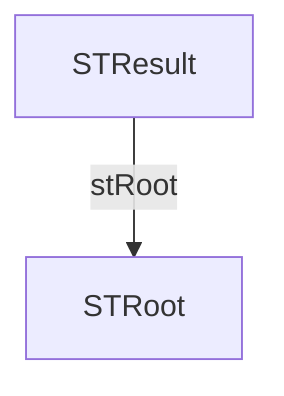

# JSON → WinDev structures

## Summary

- Structures: **2**
- Fields: **4**
- Arrays: **0**
- Variant fields: **0**
- Max depth: **2**

## Rules snapshot

- Prefixes enabled: **True**
- Serialize enabled: **True**

### Prefixes

| Kind | Prefix |
|---|---|
| string | `s` |
| int | `n` |
| real | `r` |
| boolean | `b` |
| array | `tab` |
| structure | `st` |
| variant | `v` |

### Type mapping

| JSON kind | WinDev type |
|---|---|
| string | `une chaîne` |
| int | `un entier` |
| real | `un réel` |
| boolean | `un booléen` |
| null / heterogeneous | `un Variant` |

### Array rules

- Empty array: `un tableau de Variant`
- Array of strings: `un tableau de chaînes`
- Generic: `un tableau de {item}`

## Notes

- Fields are generated using WinDev prefixes (if enabled) but keep JSON compatibility via `<serialize="jsonKey">`.
- `null` values and heterogeneous types are mapped to `Variant`.
- Empty arrays are mapped according to `array.empty` in the rules.

## Structure dependency table

| Parent structure | Field | Child structure |
|---|---|---|
| `STResult` | `stRoot` | `STRoot` |

## Mermaid dependency graph



## Structure dependencies

This section shows which WinDev structures reference other structures.

- `STResult`
  - `STRoot`


## Table of contents

- [STRoot](#stroot)
- [STResult](#stresult)

## Structures

### STRoot

| JSON key | WinDev field | WinDev type | Serialize |
|---|---|---|---|
| `a-b` | `sAB` | `une chaîne` | `<serialize="a-b">` |
| `a b` | `sAB2` | `une chaîne` | `<serialize="a b">` |
| `a_b` | `sAB3` | `une chaîne` | `<serialize="a_b">` |

### STResult

| JSON key | WinDev field | WinDev type | Serialize |
|---|---|---|---|
| `root` | `stRoot` | `un STRoot` | `<serialize="root">` |

## Generated WinDev code

```wlanguage
STRoot est une structure
    sAB est une chaîne <serialize="a-b">
    sAB2 est une chaîne <serialize="a b">
    sAB3 est une chaîne <serialize="a_b">
FIN

STResult est une structure
    stRoot est un STRoot <serialize="root">
FIN

Resultat est un STResult
```
